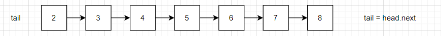
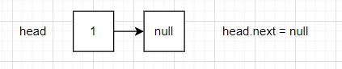
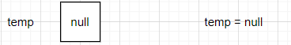
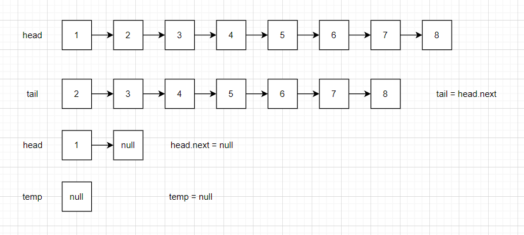
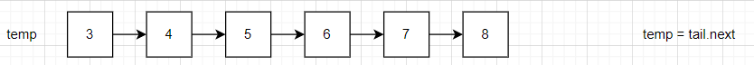
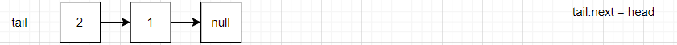
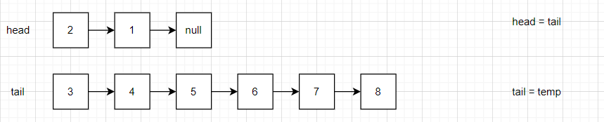
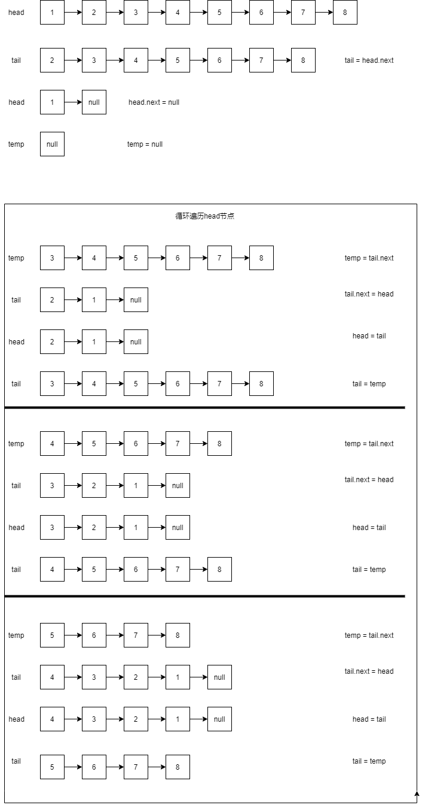

# 反转链表

## 1.先进行链表的判空

```
if (head==null){
    return null;
}
```

如果head为空，则直接返回Null

## 2.如果不为空则进行反转处理

原始head链表


首先创建一个tail来存储链表head节点之后的节点

```
ListNode tail = head.next; tail是用于防止后面的 head.next = null 的操作丢失后面节点信息
```



然后通过下面的操作将head节点独立出去，用于后面tail进行连接反转



最后创建一个temp节点作为临时存储

​	

完整的代码及过程如下

```
public ListNode ReverseList(ListNode head) {
    if (head==null){
        return null;
    }
    ListNode tail = head.next;
    head.next = null;
    ListNode temp = null;
```



目前数据初始化过程结束，接下来就是循环逆置的过程

1.首先将tail的next节点之后的内容用temp变量存起来



2.然后通过将tail的next几点指向head，就可以完成第一步逆置



3.但是还没完，还要将head指向tail,将tail指向后续内容，才能进行后面的逆置,这时候temp结点就起到作用了



4.后面就是一直往复，直到tail节点为空

完整代码及图示如下：

[图示]: resources/ReverseLinkedList.html

```
public class ReverseLinkedList {
    public class ListNode {
        int val;
        ListNode next = null;
        ListNode(int val) {
            this.val = val;
        }
    }

    public class Solution {
        public ListNode ReverseList(ListNode head) {
            if (head==null){
                return null;
            }
            ListNode tail = head.next;
            head.next = null;
            ListNode temp = null;
            while (tail!=null){
                temp = tail.next;
                tail.next = head;
                head = tail;
                tail = temp;
            }
            return head;
        }
    }
}
```




